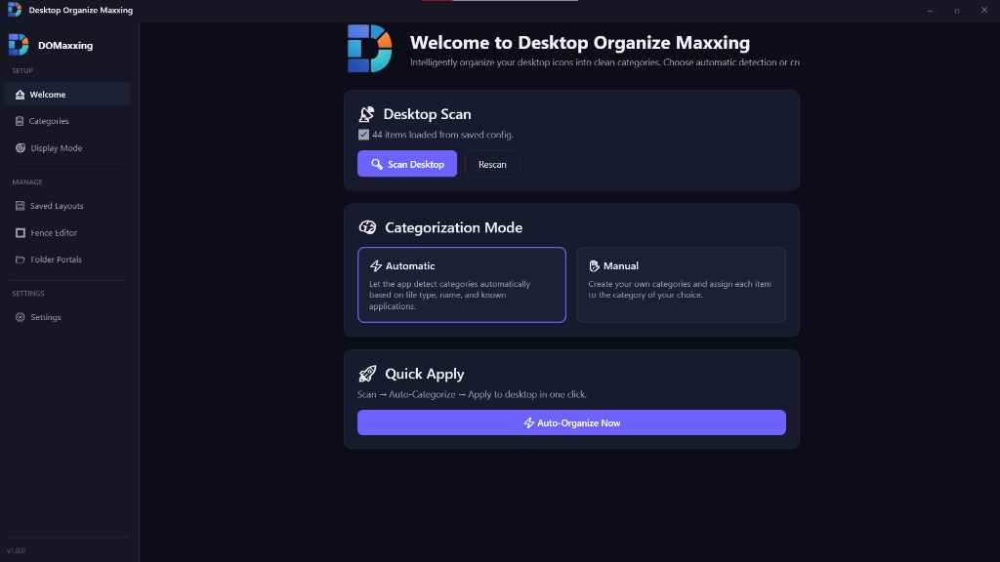
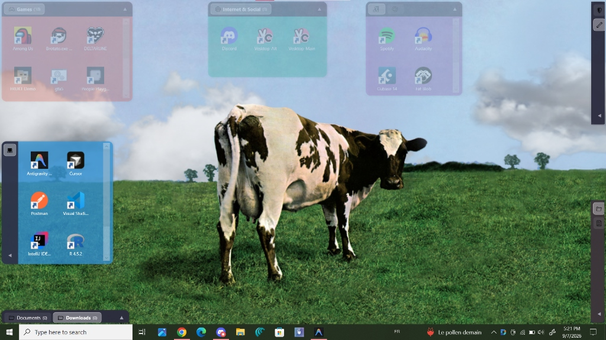
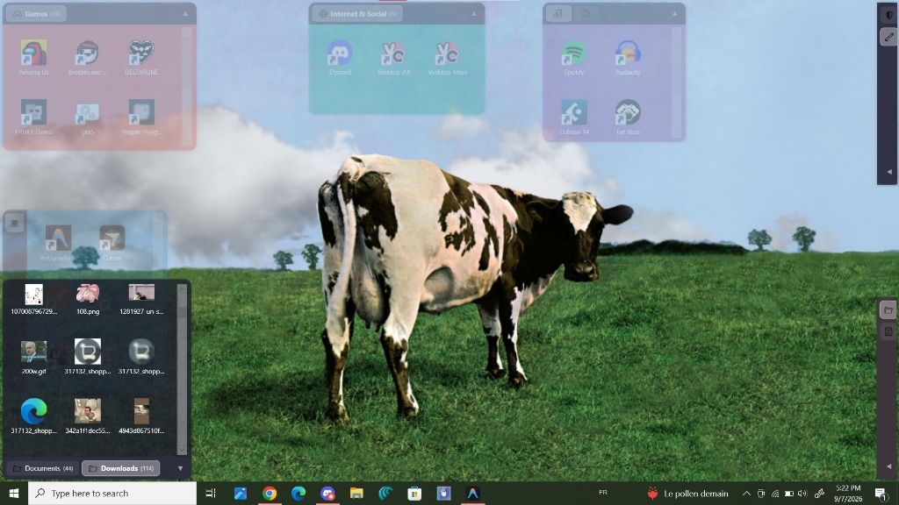
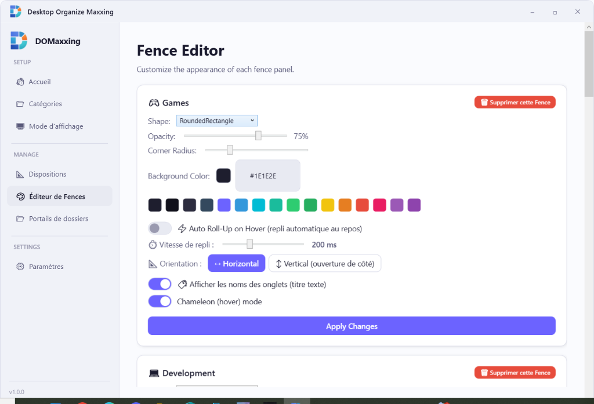

# Desktop Organize Maxxing (DOMaxxing)

<p align="center">
  
</p>

<p align="center">
  <b>The modern, lightweight desktop organizer and Fences alternative for Windows 10 & 11.</b><br>
  <i>« organize your desktop to ascend and lower your cortisol and stop crymaxx »</i>
</p>

<p align="center">
  
  
  
  
  
</p>

---

## 📑 Table of Contents

- [Overview](#-overview)
- [Screenshots & Preview](#-screenshots--preview)
- [Key Features](#-key-features)
  - [1. Two Display Modes](#1-two-display-modes)
  - [2. Multi-Tab Fences & Drag-Merging](#2-multi-tab-fences--drag-merging)
  - [3. Folder Portals](#3-folder-portals)
  - [4. Auto Roll-Up & Animation Speeds](#4-auto-roll-up--animation-speeds)
  - [5. Chameleon Hover Mode](#5-chameleon-hover-mode)
  - [6. Alt+Tab Cleanliness](#6-alttab-cleanliness)
  - [7. New Desktop Item Detection](#7-new-desktop-item-detection)
  - [8. Icon Context Menu & Recycle Bin Integration](#8-icon-context-menu--recycle-bin-integration)
  - [9. Layout Manager](#9-layout-manager)
  - [10. Full Bilingual Localization & Themes](#10-full-bilingual-localization--themes)
- [How to Use](#-how-to-use)
  - [Getting Started](#getting-started)
  - [Organizing into Fences](#organizing-into-fences)
  - [Managing Tabs and Portals](#managing-tabs-and-portals)
  - [Customizing Appearance](#customizing-appearance)
- [Installation](#-installation)
  - [Method 1: Windows Installer (Recommended)](#method-1-windows-installer-recommended)
  - [Method 2: Standalone Portable Executable](#method-2-standalone-portable-executable)
- [Building from Source](#-building-from-source)
- [Configuration & Storage](#-configuration--storage)
- [Credits & Author](#-credits--author)

---

## 🌟 Overview

**Desktop Organize Maxxing** is an ultra-fast, modern, zero-telemetry desktop management utility designed to eliminate desktop clutter, streamline your workflow, and give your Windows environment a sleek, customized aesthetic.

Built with **C# and .NET 9 WPF**, it offers both a zero-overhead native icon arrangement mode and a feature-rich visual **Fences** overlay system inspired by Stardock Fences—without the bloat, subscriptions, or high memory footprint.

---

## 📸 Screenshots & Preview

<p align="center">
  
  <br>
  <i><b>Modern Dark Dashboard</b>: One-click desktop scan, automatic categorization, and instant quick apply</i>
</p>

<br>

<p align="center">
  
  <br>
  <i><b>Desktop Fences in Action</b>: Color-coded translucent panels (Games, Internet & Social, Music, Dev) anchored cleanly to the desktop</i>
</p>

<br>

<p align="center">
  
  <br>
  <i><b>Interactive Folder Portals</b>: Browse and interact with your Documents and Downloads directly from your desktop wallpaper</i>
</p>

<br>

<p align="center">
  
  <br>
  <i><b>Fence Customizer</b>: Live control over auto roll-up speeds, colors, corner radius, opacity, and orientations</i>
</p>

---

## ✨ Key Features

### 1. Two Display Modes

* **🎯 Mode 1: Simple Organize (Native Windows Desktop)**
  * Automatically scans user and public desktop shortcuts, applications, and documents.
  * Groups and repositions your native desktop icons into clean, organized screen regions (Top-Left, Top-Right, Bottom-Left, etc.).
  * Zero persistent background overlay processes.
  * **Desktop Double-Click Peek**: Double-click empty space on your desktop wallpaper to instantly hide or reveal all desktop icons.

* **🔲 Mode 2: Fences Mode (Visual Panels)**
  * Hides native icons and renders sleek, hardware-accelerated translucent panels anchored to your desktop.
  * Double-click any icon to launch it directly.
  * Drag and drop items between fences to re-categorize them on the fly.
  * Double-click your desktop wallpaper to hide/show all fences instantly.

---

### 2. Multi-Tab Fences & Drag-Merging

* Combine multiple categories or folder portals into a single compact fence.
* **Drag-and-Drop Tab Merging**: Simply drag a tab title bar onto another fence to merge them together.
* **Tab Detaching**: Right-click any tab to detach it into its own independent fence window.
* **Tab Badges**: Displays live item counts on each tab (e.g., `⚡ Games (8)`, `🛠️ Dev (5)`).

---

### 3. Folder Portals

* Mirror any directory on your computer (e.g., `Downloads`, `Documents`, `Screenshots`, or git repositories) directly on your desktop.
* Navigate and interact with files inside your folders without having to open File Explorer.
* Real-time file sync via `FileSystemWatcher`: files added, renamed, or deleted in the folder update live inside the portal.
* Built-in pagination and cached icon rendering for ultra-fluid performance even in directories with hundreds of files.

---

### 4. Auto Roll-Up & Animation Speeds

* Keep your desktop clean while preserving instant access to all your files.
* **Auto Roll-Up on Hover**: Fences automatically roll up into a compact title bar when inactive, and smoothly expand when you move your mouse over them.
* **Customizable Roll-Up Speed**: Choose from 6 transition speeds in the context menu:
  * ⚡ *Instant (0 ms)*
  * 🚀 *Ultra-fast (100 ms)*
  * 🏎️ *Fast (175 ms)*
  * ⏱️ *Normal (250 ms)*
  * 🌊 *Smooth (400 ms)*
  * 🐢 *Slow (600 ms)*
* **Horizontal & Vertical Orientations**: Fences can roll up/down vertically, or slide open horizontally from screen borders.

---

### 5. Chameleon Hover Mode

* Enable **Chameleon Mode** on any fence to make it nearly invisible (low opacity) when resting on your desktop wallpaper.
* Moving your mouse over the fence smoothly restores full opacity and vibrant colors.

---

### 6. Alt+Tab Cleanliness

* Traditional overlay apps clutter your `Alt+Tab` switcher and Windows Task View (`Win+Tab`).
* Desktop Organize Maxxing uses Win32 `WS_EX_TOOLWINDOW` and strips `WS_EX_APPWINDOW` on all fence windows:
  * ✅ **100% invisible in Alt+Tab**
  * ✅ **100% invisible in Windows 11 Task View**
  * Keeps your window navigation completely clean.

---

### 7. New Desktop Item Detection

* Automatically monitors both User Desktop (`%USERPROFILE%\Desktop`) and Public Desktop (`C:\Users\Public\Desktop`).
* Whenever a newly installed app, file, or shortcut is detected, an interactive dialog asks which Fence or category you want to assign it to (or leave it as-is).
* Even detects `DesktopOrganizeMaxxing.exe` itself so you can classify the app into your favorite utility fence!

---

### 8. Icon Context Menu & Recycle Bin Integration

Right-clicking any icon inside a Fence, Folder Portal, or the main application window provides a complete native action suite:
* 🚀 **Open**: Launches the target application or document.
* 📂 **Open File Location**: Opens File Explorer with the exact file pre-selected.
* 🏷️ **Move to Category**: Instant submenu to reassign the item to any other category.
* 🗑️ **Delete (Send to Recycle Bin)**: Moves the item to Windows Recycle Bin using the native Windows Shell API (with standard confirmation dialog and undo capability).

---

### 9. Layout Manager

* Save snapshot layouts of your fences, categories, and icon configurations (e.g., *"Work Setup"*, *"Minimalist"*, *"Gaming"*).
* Switch between layouts with a single click. New or removed desktop icons are automatically reconciled.

---

### 10. Full Bilingual Localization & Themes

* **Languages**: Full French (`Français`) and English (`English`) translation across all sidebar tabs, settings, dialogs, and context menus.
* **Themes**: Dark Mode, Light Mode, or Auto (synchronized with Windows system theme). Custom-styled dropdowns, scrollbars, and toggle switches.
* **Single-Instance Protection**: Enforced via system Mutex (`Local\DesktopOrganizeMaxxing_SingleInstance_Mutex`). Launching a second instance automatically signals and restores the existing window to the foreground.

---

## 🚀 How to Use

### Getting Started

1. **Launch Desktop Organize Maxxing**:
   * The app opens to the **Welcome** screen.
2. **Scan Desktop**:
   * Click **🔍 Scan Desktop**. The app scans all `.lnk` shortcuts, files, and executables on your desktop.
3. **Categorization**:
   * **⚡ Automatic**: Auto-detects Categories (Games, Dev, Media, Work, System, etc.).
   * **✋ Manual**: Define custom categories with custom icons/emojis in the **Categories** tab.
4. **Choose Display Mode**:
   * Navigate to **Display Mode** and select **Simple Organize** or **Fences Mode**, then click **Apply Selected Mode**.

---

### Managing Tabs and Portals

* **Add a Folder Portal**:
  * Go to the **Folder Portals** page and click **➕ Add Folder Portal**. Select any directory (e.g., `C:\Users\<Name>\Downloads`).
* **Merge Tabs**:
  * Drag the title bar of any Fence tab and drop it onto another Fence to merge them into a single multi-tab window.
* **Detach Tabs**:
  * Right-click any tab in a multi-tab Fence and choose **Detach into new Fence**.

---

### Customizing Appearance

* Right-click anywhere on a Fence's title bar or background to open the Fence settings menu:
  * Toggle **Auto Roll-Up on Hover** and select animation speed.
  * Toggle **Chameleon Mode**.
  * Switch between **Horizontal** and **Vertical** orientation.
  * Show or hide tab title labels.
* In the **Fence Editor** page of the main app, adjust background colors, border radius, and opacity with live preview.

---

## 💿 Installation

### Method 1: Windows Installer (Recommended)

1. Download `DesktopOrganizeMaxxing_Setup.exe` from the latest release or from `publish\installer\`.
2. Run the installer:
   * Choose installation language (**French** or **English**).
   * **Create a desktop shortcut** (checked by default).
   * **Start automatically with Windows** (checked by default).
3. The app installs to `%LOCALAPPDATA%\Programs\DesktopOrganizeMaxxing` (**no Administrator password or UAC required!**).
4. Can be uninstalled at any time from Windows **Settings > Installed Apps**.

### Method 2: Standalone Portable Executable

1. Grab the single-file executable `publish\standalone\DesktopOrganizeMaxxing.exe`.
2. Run it directly—no installation, no dependencies, no external `.dll` files required. Perfect for USB drives or portable setups.


---

## 💾 Configuration & Storage

All user configurations, custom categories, saved layouts, and fence preferences are stored locally in standard JSON format:

```text
%APPDATA%\DesktopOrganizeMaxxing\config.json
```

* **Zero Cloud Sync**: Your file paths, layouts, and desktop contents never leave your machine.
* **Portable Config**: Back up or copy `config.json` to transfer your exact desktop setup to another PC.

---

## 👑 Credits & Author

* **Created by**: **Igrek**
* **Motto**: *« organize your desktop to ascend and lower your cortisol and stop crymaxx »*
* Built with ❤️ using .NET 9, WPF, and Win32 Interop.
